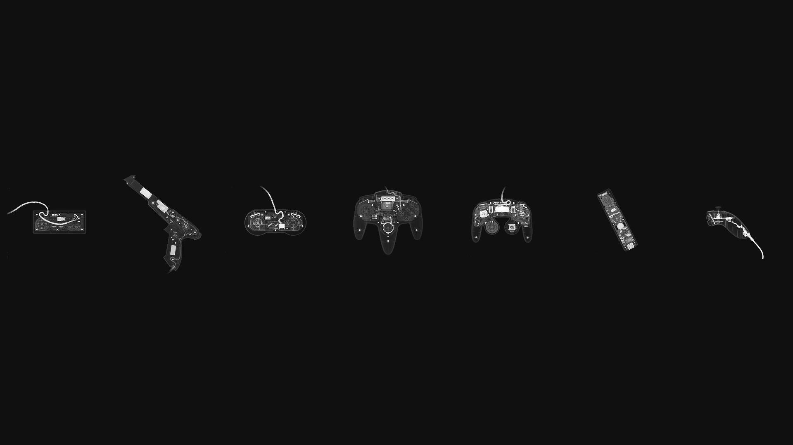

# 🖼️ Wallpaper Gallery

*Page 9 of 19 — Showcasing a collection of 170 stunning wallpapers.*

---

  <a href="readme-page-8.md">⬅️ Previous</a>
  &nbsp;&nbsp; | &nbsp;&nbsp;
  Page 9 of 19
  &nbsp;&nbsp; | &nbsp;&nbsp;
  <a href="readme-page-10.md">Next ➡️</a>

  <small>
  <a href="readme.md">1</a> • <a href="readme-page-2.md">2</a> • <a href="readme-page-3.md">3</a> • <a href="readme-page-4.md">4</a> • <a href="readme-page-5.md">5</a> • <a href="readme-page-6.md">6</a> • <a href="readme-page-7.md">7</a> • <a href="readme-page-8.md">8</a> • <strong>[9]</strong> • <a href="readme-page-10.md">10</a> • <a href="readme-page-11.md">11</a> • <a href="readme-page-12.md">12</a> • <a href="readme-page-13.md">13</a> • <a href="readme-page-14.md">14</a> • <a href="readme-page-15.md">15</a> • <a href="readme-page-16.md">16</a> • <a href="readme-page-17.md">17</a> • <a href="readme-page-18.md">18</a> • <a href="readme-page-19.md">19</a>
  </small>

<table width="100%" align="center">
  <tr align="center">
    <td width="300px" align="center">
      
       
      <small><i>wall58</i></small>
    </td>
    <td width="300px" align="center">
      
       
      <small><i>wall59</i></small>
    </td>
    <td width="300px" align="center">
      
       
      <small><i>wall60</i></small>
    </td>
  </tr>
  <tr align="center">
    <td width="300px" align="center">
      
       
      <small><i>wall61</i></small>
    </td>
    <td width="300px" align="center">
      
       
      <small><i>wall62</i></small>
    </td>
    <td width="300px" align="center">
      
       
      <small><i>wall63</i></small>
    </td>
  </tr>
  <tr align="center">
    <td width="300px" align="center">
      
       
      <small><i>wall64</i></small>
    </td>
    <td width="300px" align="center">
      
       
      <small><i>wall65</i></small>
    </td>
    <td width="300px" align="center">
      
       
      <small><i>wall66</i></small>
    </td>
  </tr>
</table>

---

  <a href="readme-page-8.md">⬅️ Previous</a>
  &nbsp;&nbsp; | &nbsp;&nbsp;
  Page 9 of 19
  &nbsp;&nbsp; | &nbsp;&nbsp;
  <a href="readme-page-10.md">Next ➡️</a>

  <small>
  <a href="readme.md">1</a> • <a href="readme-page-2.md">2</a> • <a href="readme-page-3.md">3</a> • <a href="readme-page-4.md">4</a> • <a href="readme-page-5.md">5</a> • <a href="readme-page-6.md">6</a> • <a href="readme-page-7.md">7</a> • <a href="readme-page-8.md">8</a> • <strong>[9]</strong> • <a href="readme-page-10.md">10</a> • <a href="readme-page-11.md">11</a> • <a href="readme-page-12.md">12</a> • <a href="readme-page-13.md">13</a> • <a href="readme-page-14.md">14</a> • <a href="readme-page-15.md">15</a> • <a href="readme-page-16.md">16</a> • <a href="readme-page-17.md">17</a> • <a href="readme-page-18.md">18</a> • <a href="readme-page-19.md">19</a>
  </small>

---

  <small>This gallery was automatically generated. ✨</small>
   

