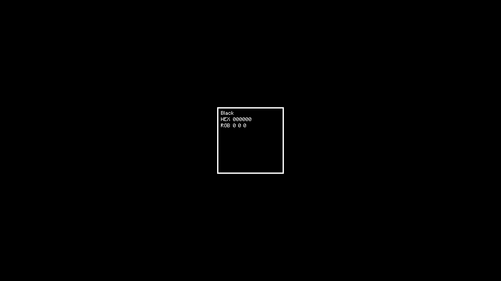

# 🖼️ Wallpaper Gallery

*Page 1 of 13 — Showcasing a collection of 113 stunning wallpapers.*

---

  ⬅️ Previous
  &nbsp;&nbsp; | &nbsp;&nbsp;
  Page 1 of 13
  &nbsp;&nbsp; | &nbsp;&nbsp;
  <a href="readme-page-2.md">Next ➡️</a>

  <small>
  <strong>[1]</strong> • <a href="readme-page-2.md">2</a> • <a href="readme-page-3.md">3</a> • <a href="readme-page-4.md">4</a> • <a href="readme-page-5.md">5</a> • <a href="readme-page-6.md">6</a> • <a href="readme-page-7.md">7</a> • <a href="readme-page-8.md">8</a> • <a href="readme-page-9.md">9</a> • <a href="readme-page-10.md">10</a> • <a href="readme-page-11.md">11</a> • <a href="readme-page-12.md">12</a> • <a href="readme-page-13.md">13</a>
  </small>

<table width="100%" align="center">
  <tr align="center">
    <td width="300px" align="center">
      
       
      <small><i>wall1</i></small>
    </td>
    <td width="300px" align="center">
      
       
      <small><i>wall2</i></small>
    </td>
    <td width="300px" align="center">
      
       
      <small><i>wall3</i></small>
    </td>
  </tr>
  <tr align="center">
    <td width="300px" align="center">
      
       
      <small><i>wall4</i></small>
    </td>
    <td width="300px" align="center">
      
       
      <small><i>wall5</i></small>
    </td>
    <td width="300px" align="center">
      
       
      <small><i>wall6</i></small>
    </td>
  </tr>
  <tr align="center">
    <td width="300px" align="center">
      
       
      <small><i>wall7</i></small>
    </td>
    <td width="300px" align="center">
      
       
      <small><i>wall8</i></small>
    </td>
    <td width="300px" align="center">
      
       
      <small><i>wall9</i></small>
    </td>
  </tr>
</table>

---

  ⬅️ Previous
  &nbsp;&nbsp; | &nbsp;&nbsp;
  Page 1 of 13
  &nbsp;&nbsp; | &nbsp;&nbsp;
  <a href="readme-page-2.md">Next ➡️</a>

  <small>
  <strong>[1]</strong> • <a href="readme-page-2.md">2</a> • <a href="readme-page-3.md">3</a> • <a href="readme-page-4.md">4</a> • <a href="readme-page-5.md">5</a> • <a href="readme-page-6.md">6</a> • <a href="readme-page-7.md">7</a> • <a href="readme-page-8.md">8</a> • <a href="readme-page-9.md">9</a> • <a href="readme-page-10.md">10</a> • <a href="readme-page-11.md">11</a> • <a href="readme-page-12.md">12</a> • <a href="readme-page-13.md">13</a>
  </small>

---

  <small>This gallery was automatically generated. ✨</small>
   

